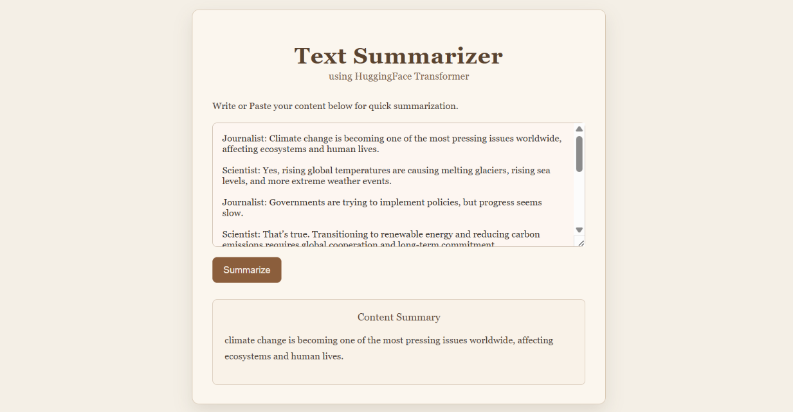

# Text Summarizer



A lightweight text summarization web app powered by a Hugging Face transformer model. The app accepts user text input and returns a concise summary through a simple browser interface.

## Project Overview

This project includes:

- `app.py` — FastAPI backend that serves the UI and handles summarization requests.
- `index.html` — Browser UI for entering text and displaying the generated summary.
- `Model Trainning & Testing/` — Notebook and dataset files for training and testing the summarization model.

## Features

- Clean web interface with classic styling.
- Uses a pre-trained text summarization model from Hugging Face.
- Supports natural language input via a browser form.
- Returns summaries with a single button click.

## Requirements

- Python 3.9+
- `fastapi`
- `uvicorn`
- `transformers`
- `torch`
- `pydantic`

## Installation

1. Clone the repository or download the project files.

2. Create and activate a Python virtual environment:

```bash
python -m venv venv
.\venv\Scripts\activate
```

3. Install dependencies:

```bash
pip install fastapi uvicorn transformers torch pydantic
```

> If you have a GPU and want optimized performance, install a compatible `torch` build for your CUDA version.

## Running the App

From the project root directory, run:

```bash
uvicorn app:app --reload
```

Then open your browser and navigate to:

```text
http://127.0.0.1:8000/
```

## Usage

1. Enter or paste the text you want to summarize into the input area.
2. Click the `Summarize` button.
3. The generated summary will appear in the output box below the form.

## Project Flow

1. `index.html` renders the web form and JavaScript handles form submission.
2. When the user submits text, the frontend sends a POST request to `/summarize/`.
3. `app.py` receives the request, cleans the input text, tokenizes it, and sends it through the Hugging Face model.
4. The model generates summary tokens, which are decoded into human-readable text.
5. The app returns the summary to the browser and displays it.

## Notebook Process

The notebook in `Model Trainning & Testing/text_summarizer.ipynb` describes the full model preparation and training workflow:

- Load and inspect the SAMSum dataset CSV files (`samsum-train.csv`, `samsum-validation.csv`).
- Clean the dialogue and summary text by removing extra whitespace, newline characters, and HTML tags.
- Tokenize the input dialogues and target summaries using the T5 tokenizer.
- Convert tokenized data into training and validation datasets for model fine-tuning.
- Initialize the `t5-small` model and train it with `Trainer` and `TrainingArguments`.
- Evaluate the model on validation data and save the fine-tuned model locally.
- Optionally upload the saved model to Hugging Face Hub for reuse in the app.

## Notes

- The app currently loads the model from the Hugging Face hub path `HelloShiwansh/text-summarizer-model`.
- Model page: https://huggingface.co/HelloShiwansh/text-summarizer-model
- If you want to use a local saved model, update `app.py` to load from `./saved_summary_model` instead.
- The notebook inside `Model Trainning & Testing/` demonstrates training and evaluation steps.

## File Summary

- `app.py`: FastAPI backend and summarization logic.
- `index.html`: Frontend UI and client-side JavaScript.
- `Model Trainning & Testing/text_summarizer.ipynb`: Notebook for model training/testing.

